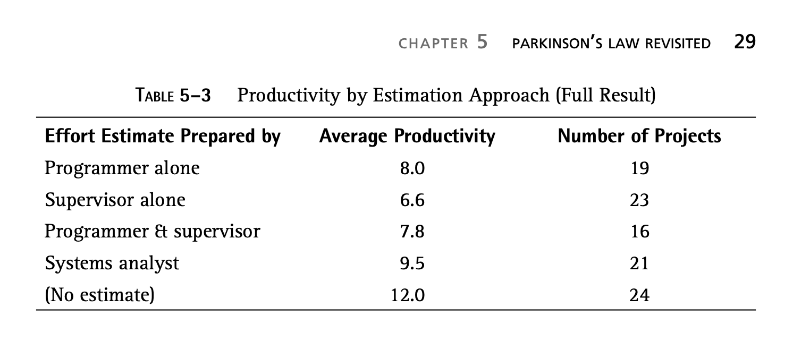
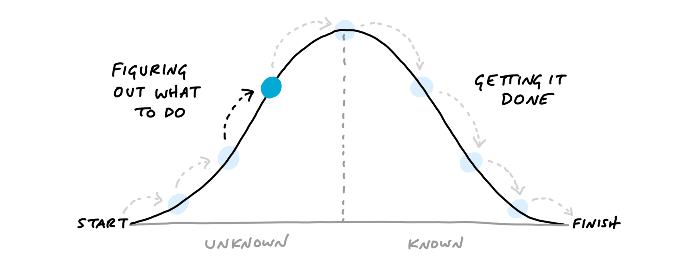
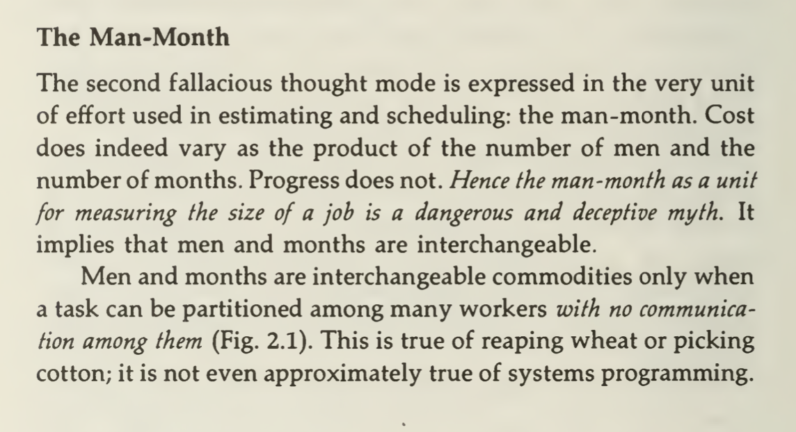

Since we began developing software, we’ve looked for ways to reliably estimate
our development time. Now, some 60+ years later, we've gotten no better at it.
Maybe the problem is not in how we estimate, but that we're so concerned with
estimates in the first place.

Take the popular Scrum framework. At its core, Scrum is based on estimating the
future work and taking only as much as you can supposedly do into the next
sprint. At first glance, it sounds reasonable. In reality, more often than not,
it means trading team performance for the illusion of planning. I’ll explain
why.

## Estimates slow us down

People naturally want to be good at what they're doing. At first, developers
tend to be optimistic, and accordingly tend to underestimate their task times.
What inevitably happens next is they commit to the specific timeline that they
themselves stated and fail. This makes them feel uncomfortable, even when no
one blames them (and sometimes people do blame them). As the process repeats
itself, they slowly learn to overestimate, because they don't want to fail.

Counterintuitively, overestimating doesn't always help people to finish their
work on time. This effect is known as
[Parkinson's Law](https://en.wikipedia.org/wiki/Parkinson%27s_law), and here's
where psychology plays against us. Let's say you think a task will take a
couple of days, but, given the uncertainty, you might need up to a week. You
estimate a week, and your manager says "fine." Now you think - alright, I have
plenty of time! As a result, in the first half of the week, you either work in
a relaxed mode or shift your priorities to other tasks, because you know that
you have plenty of time. As the timeline approaches, you start to realize that
the task is not as simple as you’d initially thought and remember why you
overestimated in the first place. So you work hard, maybe stay late, and
finally, barely fit the work into the timeline you set for yourself. Next week,
the same story happens again.

Ultimately, problems happen either way you estimate. If team members are under
time pressure (often because they’ve underestimated), they may have to cut
corners to meet the timeline. Surprisingly, if they overestimate, the same
thing happens, just later. As a rule of thumb, you may think of deadlines as
"the earliest dates when something can be delivered." So no matter whether they
over- or underestimated, nothing ships until the deadline.

*Source: [Peopleware by Tom DeMarko and Timothy Lister](https://www.amazon.com/Peopleware-Productive-Projects-Tom-DeMarco/dp/0932633439)*

Estimates slow the team down, and the more frequently you ask developers for
estimates, the worse the effect becomes. If a team estimates all the work it’s
doing, then the amount of time and energy it must spend on the estimating
process will be overwhelming. First, people spend time making the estimates.
After that, they spend time discussing why those estimates failed and what they
should do next (usually, the solution is to request more estimates.) Next,
requirements change - and voila, now they have to figure out how the change
affects their estimates. Finally, they deal with the technical debt accumulated
in their numerous attempts to meet the estimated timelines, slowing the project
down in the long term.

## Quick estimates are just guessing

The nature of software development entails a lot of complexity and uncertainty.
Almost all of the work that developers do is something new. Even if they’ve
done something similar in the past, they're now doing it in new conditions.
There might be a new project, or new requirements, or new knowledge learned
from the last experience. If it were absolutely the same and routinely
repeated, it’d likely already be automated, or be implemented as an
out-of-the-box product, or exist as a library or framework. Therefore, in most
cases, developers have to provide estimates for tasks that have a high degree
of uncertainty.

*Source: [Show Progress | Shape Up by BaseCamp](https://basecamp.com/shapeup/3.4-chapter-12)*

It could be better if developers are given some time to work on the problem in
advance; in such cases, they would understand the problem better and be more
confident providing an estimate. Unfortunately, it rarely happens in practice.
Developers usually have very little time to study a problem before someone asks
them for an estimate. As a result, they pluck numbers out of thin air.

Of course, all experienced managers know that estimates are just estimates and
don't try to treat them as hard deadlines. However, they are perceived as some
form of commitment anyway, by both managers and developers. If estimates mean
absolutely nothing, why ask for them in the first place? So providing an
estimate means being accountable for it. It's no surprise that developers often
don't like them - basically, we ask them to be accountable for something that
they don't fully understand.

## Estimates create dangerous misconceptions

Uncertainty is not the only problem with estimates. They can also create
misconceptions about the workflow for the project team and stakeholders. As
Fred Brooks famously said, "The bearing of a child takes nine months, no matter
how many women are assigned." However, when people hear that a project will
take nine man-months, they sometimes assume that it probably can be three
months for three random developers.

*Source: [The Mythical Man-Month by Frederick P. Brooks](https://www.amazon.com/Mythical-Man-Month-Anniversary-Software-Engineering-ebook/dp/B00B8USS14/)*

Men and months are not interchangeable, and not just because some work can't be
done in parallel. Who is doing the work also matters. A senior developer who’s
also familiar with the matter could probably do it much faster than estimated,
and a junior developer with no knowledge of the subject may not just miss the
deadline, but fail the task altogether.

## Initial development is a minor cost

Arguably the biggest problem with estimates is that people routinely ask for
initial development estimates, but rarely ask for estimates about the
subsequent maintenance. Maintenance is huge. It takes up to
[60-90%](https://www.google.com/search?q=software+initial+development+vs.+maintenance+costs)
of the total project cost. Besides that, every feature that you add to the
product increases complexity and makes further development slower. With this
fact in mind, people should be very cautious about adding new features.
Instead, prioritize like a maniac, and work on only the features that make the
most sense. This rarely happens when estimates drive project planning. In such
projects, people tend to push features that take less time and postpone the
ones that will take longer. As a consequence, the most important work can be
postponed and the product becomes bloated with less important features and
quick hacks.

## How is it possible to plan a project without estimates?

Ok, so estimates take their toll. They can be misleading, they can slow a team
down and make developers uncomfortable, but we need them for project planning
anyway, right? Well, not necessarily. Sometimes estimates are unavoidable, but
in most cases, they are not required for project decisions.

First, the initial development estimates shouldn't be the driving factor that
determines what to work on next. It would be best if you only worked on what
is crucial, and not on what is fast to implement. If you're not absolutely sure
that a feature is essential, it shouldn't be in the development queue. Use
quick MVPs and product discovery to find out what your customers need.

Second, when you have a timeline to meet, communicate it to developers instead
of asking for their estimates. There's the excellent
[Fix Time and Budget, Flex Scope](https://basecamp.com/gettingreal/02.4-fix-time-and-budget-flex-scope)
approach. Every task can be completed in thousands of ways. Prioritize the
requirements carefully, work on the most critical items first, and be ready to
ship at any time. In such conditions, timelines become manageable. Even if
you're not lucky enough to ship it fully, the most important features will be
there and the least important will be missing, which quite often aren’t
critical to launching.

Finally, if you badly need an estimate, give developers a few days to work on
the task before asking. If you're lucky, the task will already have been
completed, and no estimate will be needed. Otherwise, they will understand the
task better, and you'll be able to have much more productive talk about the
task challenges. Make sure that you take into account not only initial
development estimates but also long-term maintenance, which is usually more
important. And once again, if you're not sure that the task is essential, it
shouldn't be in the development queue, even for estimates.

## Managing expectations

This one is probably the most challenging. As a manager or a team lead, you
will likely deal with stakeholders who will wonder how long a project will take.
If you ask them why they need this information, they'll tell you it's necessary
for planning or that they simply want to know what to expect. We discussed
planning above, now let's turn to expectations. It’s human nature to be
concerned if something you care about is uncertain. It may be your boss
who’s asking, and it may be hard to say, "I don't know." Here's what you can
try:

1. if the work’s already in the queue or in progress, ask what plans related to
   the completion of this work. Try to help them execute their plans. Sometimes,
   you may use this information as an input for work prioritization and
   communicate their expectations to the team. Other times, you may find
   workarounds that would help those people to achieve their goals while the
   task’s still in progress;
2. if the work is not in the development queue yet, ask about its priority.
   Talk about the plans that the development team already has, try to figure
   out where this new work can fit. Sometimes you'll find there's no chance
   that you'll work on it anytime soon, and if so - there's not much sense in
   discussing estimates;
3. focus on team productivity and work transparency. If your team ships to
   production every day and everyone can see the work and the queue, people are
   less inclined to ask for estimates;
4. as a manager or a team lead, track the progress of your team regularly. Know
   what was done and what’s remaining, what the blockers are, etc. If you know
   what's going on, you can make your own estimates and communicate them to
   stakeholders when you think it's necessary. Remember, good managers work as
   a "shit umbrella" for the team; bad managers let the shit fall through.
   Passing all requests for estimates down to developers is not good management
   practice.

## Conclusion

To summarize, while estimates look appealing and straightforward on the surface,
really they are misleading and obstructive to the workflow. It’s natural for
humans to simplify complicated things, but estimates simplify the perception of
the development process far beyond what’s reasonable. Scrum can take this
over-simplification to the extreme with its planning poker, velocity, and
burn-down charts.

Most people would agree that, though estimates are imperfect, they are at least
measurable. They can't imagine how to manage a project without having something
measurable. Unfortunately, not everything that counts can be measured, and not
everything that can be measured counts. In this post, I provided some practical
advice from my experience of managing projects without estimates. Of course, I'm
not saying that estimates are entirely useless; I'm just saying that most of the
time, other more important factors should be at play. I’ve used this approach
for years, and it’s worked well for our teams.

I realize that this advice is not for everyone. I worked with different
organizations, big and small, and most of them used estimates in one form or
another. At the same time, most organizations are far from efficient. The way
the best teams operate is often different from the way the majority does.
Perhaps the emphasis placed on estimates is one place where these differences
lie.

That's all I have for now. If you have any comments or questions - please feel
free to reach me on [Twitter](https://twitter.com/dstebunov). This post may be
edited later if I have more thoughts on it. In such a case, the history will be
available here on Github.

-----

P.S. More on the topic:

* [Dave Farley - How To Estimate Software Development Time (video, 17 min)](https://youtu.be/v21jg8wb1eU)
* [BaseCamp - Fix Time and Budget, Flex Scope](https://basecamp.com/gettingreal/02.4-fix-time-and-budget-flex-scope)
* [Richard Clayton - Software Estimation is a Losing Game](https://rclayton.silvrback.com/software-estimation-is-a-losing-game)
