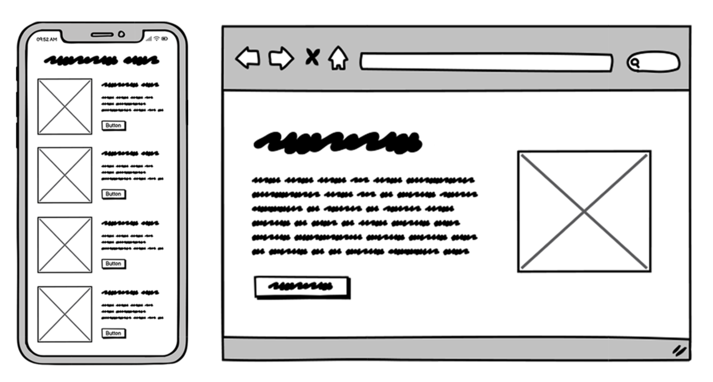
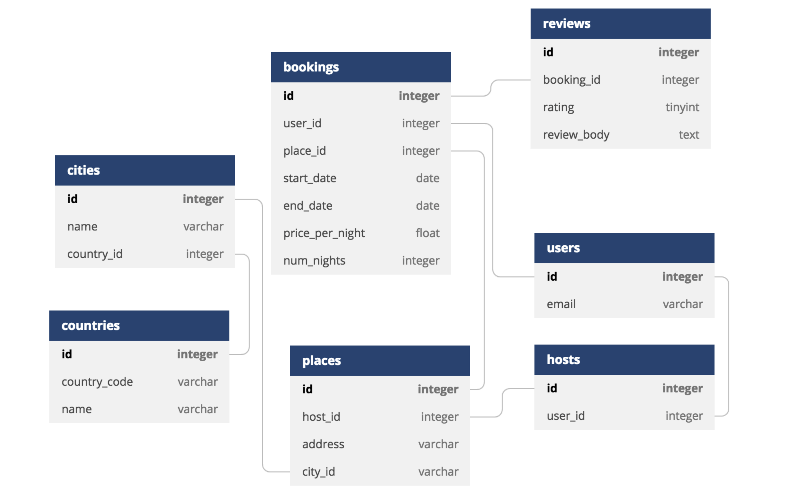

After you decide which feature you want to build, how do you actually build it? 
Over the years, I have participated in dozens of software development projects 
as a developer and engineering manager. I have built numerous features myself 
and have been lucky to collaborate with many talented people and observe how 
they work.

Below is my go-to checklist for starting work on a new feature. It's based on my 
experience and the teams I supervised – what worked well, and if problems arise, 
where did they stem from? Of course, the approach I propose might not fit every 
situation. However, so many problems in my practice fall into these three 
buckets that I thought it was worth treating them as a checklist:

## #1: Understand "why"

- Who will use this feature?
- What problem are we trying to solve for them?
- Why are we going to solve it this way?

Sometimes, developers skip these fundamental questions and jump right into the
code. It's understandable. They're eager to do what they love, and also – isn't
it the product manager's job to think about such questions? Well, it certainly 
is, but that doesn't mean this information is useless for us developers.

While working on a feature, we face many decisions on all levels, from "How do
I name this variable?" to "We ran into a technical issue and need to find a
workaround." A strong understanding of the task context is essential for
navigating these decisions. It's also worth thinking a bit ahead:

- How may this functionality evolve in the future?
- How much data may we need to store?
- Which system failures will cause a bad user experience, and how will we 
  handle that?
- ... and so on.

Answers to these and similar questions make the difference between great and 
poorly designed software, and once again, we need to understand the task 
context to get it right.

In the ideal world, the task description already answers the most important 
questions – who the users of this feature are, what problem we solve, and why 
we are going to solve it this way. In practice, this is not always the case, 
and sometimes developers are shy about asking or think it's not their business.
Please don't skip it. Not only will it help you solve this particular problem 
better, but it's also crucial for your professional growth.

## #2: UX design

Regardless of the interface you're building — a UI, API, or command line — 
think through the user interface before jumping to the code.

If someone else has already prepared the designs, that's awesome, so study them
carefully first. You might spot problems or inconsistencies and report them to
the designer early. Even if it's all clear and reasonable, it's still time well
spent because now you have a much better understanding of what you're building.

If there are no designs yet, and you're supposed to come up with something, 
please work on the designs before the code! Some developers, when they need to 
build a UI, tend to postpone it because they doubt their design skills and
prefer to start from something else - something they're more familiar with. 
Don't do that. Understanding how users will interact with the system should be
your top priority. It'll likely save you a lot of development time, and the
result will be much better.

You can still produce something useful even if you're not a professional 
designer. For example, you can use a rapid wireframing tool like 
[Balsamiq](https://balsamiq.com) (my favorite) or 
[Excalidraw](https://excalidraw.com). With such a tool, you can sketch an idea
quickly without spending time on minor visual details. Or, use a whiteboard or
good old pencil and paper. Any sketch is better than nothing.

*Low-fidelity [Balsamiq](https://balsamiq.com) wireframes*

And if you're building an API or a command-line interface, your design would be
the documentation and usage examples. It doesn't have to be polished at this 
stage but should include at least the most important use cases.

## #3 - Data structures

> "Bad programmers worry about the code. Good programmers worry about data 
> structures and their relationships." - Linus Torvalds.

> "Smart data structures and dumb code works a lot better than the other way 
> around." - Eric S. Raymond. 

Yes, data structures are important. Depending on the task, we may optimize them
for data consistency, speed, storage requirements, and developer experience, 
and how we organize data may have vast implications in all of these dimensions.
However, the reason why they're on my list is something else:

Data structures are harder to change. If we modify a data structure, we'll have
to update all of the code that works with it and also migrate the existing data
to the new structure, which can be quite a challenge depending on the project 
stage and size. As a result, data structures often live longer than the original
code that was shipped with them. Also, building more features on top of existing
data structures is quite common, so it makes sense to make them future-proof to
some degree.

This is why data structures are #3 on my list. After we study the task context
and understand how users will interact with the system, this is the next 
important thing to tackle. We can certainly revise data structures later while
working on a feature, maybe even multiple times, but given their importance and
potentially problematic updates, we should start working on them as early as
possible.

If the project is based on a relational database and the feature you're working
on uses multiple tables, it might be a good idea to visualize it using an ER 
diagram. ER diagrams are arguably the most useful part of the UML 
specification. You may skip everything else in UML, but if you're working with
relational databases - don't skip ER diagrams :)

*Credit: [dbdiagram.io](https://dbdiagram.io)*

## Summary

When you start working on a new feature:

1. Understand "why";
2. Review UX designs or create your own;
3. Design data structures;
4. Code.

In that order.
